 

 

 

<a href="https://www.behance.net/burhanyenier">Behance ↗</a> &nbsp; / &nbsp;
<a href="https://www.linkedin.com/in/buremiyen">LinkedIn ↗</a>

  

Curiosity is part of the toolkit.

whoami / text version

**Burhan Emin Yenier** · Graphic Designer · 3D Artist · Game Developer

Graphic Design student at **Selçuk University**. Designing visuals, building worlds, and turning ideas into playable experiences.

- **Visual design:** Photoshop, Illustrator, After Effects, Figma
- **3D & games:** Blender, Unity, C#
- **Creative tech:** Git, GitHub, UI/UX, AR, Creative AI

*Design it. Build it. Make it fun.*

<!-- Maintenance: docs/profile-art.md. Project lists intentionally omitted. -->
